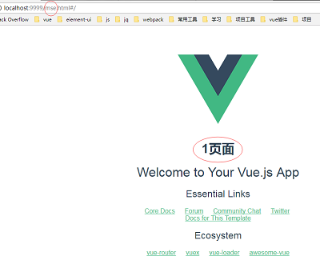
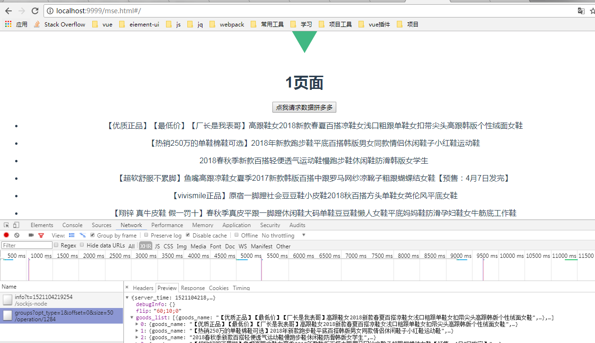

## vue-cli如何搭建多页面
-------------------------------------------------------------------------------------------------------------------------------
### 目录
###### <a href="#1">1.如何使用本项目</a>
###### <a href="#2">2.搭建脚手架</a>
###### <a href="#3">3.多页面原理介绍（纯静态写的多页面）</a>
###### <a href="#4">4.如何设置动态多页面</a>
###### <a href="#5">5.添加axios,以及本地代理功能</a>
###### <a href="#6">6.过滤不需要打包的模块</a>


### <a name="1">如何使用本项目？</a>

#### 本项目建立多页面步骤为：
* 建立一个iflow页面
```
> 1 html/下新建文件 iflow.html
> 2 src/下新建文件夹及内容 iflow/
                           /app/App.vue 
                           /routes/router.vue 
> 3 entry/新建文件 iflow.js
```

### <a name="2">搭建脚手架</a>
### 本地先安装vue脚手架
```
npm install vue-cli
```
### 选取webpack模版（这里我们使用的是webpack模版）
###### 需要注意的是项目的名称不能大写，不然会报错。
```
vue init webpack Name(取项目名)
```
###### 选项翻译
```
Project name (my-project) # 项目名称（我的项目）

Project description (A Vue.js project) # 项目描述一个Vue.js 项目

Author 作者（你的名字）

Install vue-router? (Y/n) # 是否安装Vue路由，也就是以后是spa（但页面应用需要的模块）

Use ESLint to lint your code? (Y/n) # 使用 ESLint 到你的代码？ （Y [ yes ] / N [ no ]）

Pick an ESLint preset (Use arrow keys) # 选择一个预置ESLint（使用箭头键）

Setup unit tests with Karma + Mocha? (Y/n) # 设置单元测Karma + Mocha？ （Y/ N）

Setup e2e tests with Nightwatch? (Y/n) # 设置端到端测试，Nightwatch？ （Y/ N）
```


### 进去该项目
```
cd Name
```
### 安装依赖
```
npm install
```

### 运行
```
npm run dev
```
* 然后访问http://localhost:8080 //默认端口为8080，访问失败可以是端口被占用了，在config/index.js里改dev:{port}，换一个端口尝试


### <a name="3">多页面原理介绍</a>

### 下面开始为脚手架配置多页面原理，此次搭建的是写死的配置，后面会添加动态方法

#### 效果图：



#### 多页面配置分dev环境跟prod环境

* 我把html部分都放到了./html里面，把入口文件都放到了./src/entry/这个文件夹下面，方便统一管理，现在我们先安装好脚手架

##### 首先是公共配置
打开webpack.base.conf.js，找到entry，添加多入口
```
//多页面入口,文件开始路径为项目初始路径
entry: {
    mse: './src/entry/mse.js',
    from: './src/entry/from.js',
    common: './src/entry/common.js',
},

```
###### 运行、编译的时候每一个入口都会对应一个Chunk

### dev环境部署

###### 修改 webpack.dev.conf.js
* 打开 ~\build\webpack.dev.conf.js ，在plugins下找到new HtmlWebpackPlugin，在其后面添加对应的多页，并为每个页面添加Chunk配置

```
    new HtmlWebpackPlugin({
      filename: 'mse.html',//访问地址
      template: './html/mse.html',//来源路径
      inject: true,//是否开启注入
      chunks: ['mse']//入口文件，在base里的入口参数entry配置，需要引入的Chunk，不配置就会引入所有页面的资源
    }),
    new HtmlWebpackPlugin({
        filename: 'from.html',
        template: './html/from.html',
        inject: true,
        chunks: ['from']
      }),
      new HtmlWebpackPlugin({
        filename: 'common.html',
        template: './html/common.html',
        inject: true,
        chunks: ['common']
      }),
```
* chunks: ['mse']中的mse对应的是webpack.base.conf.js中entry设置的入口文件

#####修改完了以后再根据此项目目录结构对应修改，重新npm run dev 下，然后出入对应html即可出现

### prod环境部署

###### 打开~\config\index.js，找到build下的index: path.resolve(__dirname, '../dist/index.html')，在其后添加多页

```
    build: {
        mse: path.resolve(__dirname, '../dist/mse.html'),
        from: path.resolve(__dirname, '../dist/from.html'),
        common: path.resolve(__dirname, '../dist/common.html'),
    ...
    }
```

###### 修改 webpack.prod.conf.js
* 打开~\build\webpack.prod.conf.js，在plugins下找到new HtmlWebpackPlugin，在其后面添加对应的多页，并为每个页面添加Chunk配置
* HtmlWebpackPlugin 中的 filename 引用的是 config/index.js 中对应的 build

```
    plugins: [
        new HtmlWebpackPlugin({
            filename: config.build.mse,//入口文件
            template: './html/mse.html',//来源路径
            inject: true,
            minify: {
                removeComments: true,
                collapseWhitespace: true,
                removeAttributeQuotes: true
            },
            chunksSortMode: 'dependency',
            chunks: ['manifest','vendor','mse']//需要引入的Chunk，不配置就会引入所有页面的资源
        }),
        new HtmlWebpackPlugin({
            filename: config.build.from,
            template: './html/from.html',
            inject: true,
            minify: {
                removeComments: true,
                collapseWhitespace: true,
                removeAttributeQuotes: true
            },
            chunksSortMode: 'dependency',
            chunks: ['manifest','vendor','from']
        }),
        new HtmlWebpackPlugin({
            filename: config.build.common,
            template: './html/common.html',
            inject: true,
            minify: {
                removeComments: true,
                collapseWhitespace: true,
                removeAttributeQuotes: true
            },
            chunksSortMode: 'dependency',
            chunks: ['manifest','vendor','common']
        }),
    ]
```
###### 这样，生产环境配置就修改完了，是不是没想象中这么麻烦呢，哈哈。现在打包npm run build 。如果出错了请检查自己的修改的是不是哪里写错了。一般是没问题的，本人亲测有效。打包好之后就丢进服务器里，访问即可看到效果啦！！！

* 这是基于脚手架之多页面搭建的原理，都是用死方法写的，下次更新我会把他动态出来。到时候配置好，你就不用管其他，只需要添加文件夹，入口文件即可。

> -------------------------------------------------------------------------------------------------------------------------------------

### <a name="4">如何设置动态多页面？</a>
### 首先我们需要用到几个插件
* 我们现在utils.js文件引入跟加入我们需要的插件和文件
```
// utils.js
// 引入页面模版
const HtmlWebpackPlugin = require('html-webpack-plugin')
// 用于做相应的merge处理
const merge = require('webpack-merge')
// 取得/src/entry下的所有入口文件
var PAGE_PATH = path.resolve(__dirname, '../src/entry')
// 取得/html下的所有html文件
var PAGE_HTML_PATH = path.resolve(__dirname, '../html')
```


#### 然后我们在utils.js里面添加两个动态获取入口/页面的方法

* 定义entries方法动态在webpack.base.conf.js里动态设置多页面入口
```
//动态设置多页面入口
exports.entries = function() {
    var entryFiles = glob.sync(PAGE_PATH + '/*.js')//获取当前路径下所有.js的文件
    var map = {}
    entryFiles.forEach((filePath) => {
        var filename = filePath.substring(filePath.lastIndexOf('\/') + 1, filePath.lastIndexOf('.'))
        map[filename] = filePath
    })
    return map
}
```
* 详情查看源代码
```
//多页面入口,文件开始路径为项目初始路径
//   entry: {
//     mse: './src/entry/mse.js',
//     from: './src/entry/from.js',
//     login: './src/entry/login.js',
//   },
```
//动态设置多页面入口
entry: utils.entries(),

* 定义htmlPlugin方法，用来获取html进行动态设置webpack
```
//动态获取html文件 与上面的多页面入口配置相同，读取html文件夹下的对应的html后缀文件，然后放入数组中
exports.htmlPlugin = function() {
    let entryHtml = glob.sync(PAGE_HTML_PATH + '/*.html')
    let arr = []
    entryHtml.forEach((filePath) => {
        let filename = filePath.substring(filePath.lastIndexOf('\/') + 1, filePath.lastIndexOf('.'))
        let conf = {
            // 文件名称
            filename: filename + '.html',
            // 模板来源
            template: filePath,
            // 页面模板需要加对应的js脚本，如果不加这行则每个页面都会引入所有的js脚本
            chunks: ['manifest', 'vendor', filename],
            inject: true
        }
        if (process.env.NODE_ENV === 'production') {//生产环境
            conf = merge(conf, {
                //压缩HTML文件
                minify: {
                    removeComments: true,
                    collapseWhitespace: true,
                    removeAttributeQuotes: true
                },
                //按照模块的依赖关系依次加载，即：manifest，vendor，本页面入口，其他页面入口.
                chunksSortMode: 'dependency'
            })
        }
        console.log(conf)
        arr.push(new HtmlWebpackPlugin(conf))
    })
    return arr
}
```
* 在webpack.dev.conf.js和webpack.prod.conf.js中都添加下面代码
* 在plugins数组后面添加此方法
```
plugins: [].concat(utils.htmlPlugin())
```
#### 这样就完成了动态设置，此时在config/index.js中注释掉下面代码就行了
```
build: {
    // Template for index.html
    // mse: path.resolve(__dirname, '../dist/mse.html'),
    // from: path.resolve(__dirname, '../dist/from.html'),
    // login: path.resolve(__dirname, '../dist/login.html'),

    ...}
```

### 这样的好处就是每个页面的router都是独立的，如果想只需要一个路由，那么应该在入口文件中都引入同一个路由就行了，理论上应该是这样，各位可以试试。


### 这样就可以了，如果不清楚哪里修改请查看源代码。

> -----------------------------------------------------------------------------------------------

###### <a href="5">添加了axios,以及本地代理功能</a>

### axios，是尤大大在vue2中推荐使用的请求方式，所以在这个项目中，我也加了此功能，用来请求数据

#### 首先我们先安装axios
```
//--save 发布后还需要依赖的模块
//--save-dev 开发才用到它。
npm install axios --save 
```

##### 然后我们在/config此文件夹下新建 http.js

* 之所以在这里建立http.js，是想独立开这个axios这个功能，方便管理

然后引入我们安装好的axios
```
import axios from 'axios';//引入axios

import NProgress from 'nprogress'; //引入进度条插件 ，npm install --save nprogress
import 'nprogress/nprogress.css'; // 引入进度条css文件，相对路径即可


//axios 基本配置
axios.defaults.timeout = 50000;//请求超时时间
axios.defaults.withCredentials = true;//运行跨域
//设置头部信息
axios.defaults.headers.common['Cache-Control'] = "no-cache";
axios.defaults.headers.common['Pragma'] = "no-cache";
```
然后我们在这个文件加上拦截器

```
//添加一个请求拦截器
axios.interceptors.request.use(function(config){
    //在请求发出之前进行一些操作
    NProgress.start();//进度条开始
    return config;
  },function(error){
    NProgress.done();//进度条结束
    //Do something with request error
    return Promise.reject(error);
});

//添加一个响应拦截器
  axios.interceptors.response.use(function(res){
    //在这里对返回的数据进行处理
    NProgress.done();
    return res;
  },function(error){
    NProgress.done();
    if (error.response) {
        switch (error.response.status) {
            case 401:
                console.log('接口返回401，请查看是否未登录。跳至登录页面')
        }
    }
    //Do something with response error
    return Promise.reject(error);
  })

   export default axios;//最后我们要对axios导出去使用
```

##### 现在我们已经对axios准备完毕了，然后我们就可以使用啦。。

#### 这个时候就涉及到接口问题了，现在这个项目中有两个环境，本地环境跟生产环境，而接口在本地会出现跨域问题，我们先要解决跨域问题
##### 我们在config/index.js这里配置代理

```
dev{
    //设置代理
    proxyTable: {
        '/operation/':{//将这个应用名下的请求转接为http://apiv2.pinduoduo.com下
            target: 'http://apiv2.pinduoduo.com/',
            secure: false
        },
        //如果多个不同的接口那就再加就行了，例如
        <!-- '/api/':{
            target: 'http:baidu.com/',
            secure: false
        }... -->
    },
}

```
* 这样本地代理就完成了，那生产环境呢，这个一般我们打包好了项目丢到服务器中不会出现跨域问题，如果有的话让后端设置对应的处理就行了,所以我们在生产环境中基本不需要管跨域的问题.

###### 不过我们需要区分开本地环境跟生产环境的域名，所以这时候我们还需要在config/下的额dev.env.js跟prod.env.js中设置对应的域名

* 拿拼多多接口为例，在这两个文件中我们添加多一个字段，用来区分不同环境对应不同域名
```
// dev.env.js
API_pingDuo:"/operation/",//因为配置了代理，所以本地只需要配应用名就行了

//prod.env.js
API_pingDuo:'"http://apiv2.pinduoduo.com/operation/"',//生成环境需要放到对应服务器方可请求，否则报错。
```
#### 现在我们的环境问题也已经解决了，接下来我们就开始准备使用请求接口啦。。。

###### 我们在src/下新建api目录，在里面再新建api.js跟main.js
* api.js是用来专门放api用的
* main.js 是专门用来放请求用的，网上很多都是说把axios挂在vue的原型中，在组件中使用，这样个人觉得不方便管理，我们应该把每个功能点独立开来，这样方便我们后期的维护

在api.js,在网上找到一个拼多多接口，不需要token校验，所以在本项目中拿来使用，勿怪勿怪。
```
//专门定义api
export const pingDuo = process.env.API_pingDuo + '1284/groups?';

```
在main.js中写各种接口
```
import * as api from './api'; //引入我们的所有接口
import axios from '../../config/http';//引入我们加了拦截的axios
import qs from 'querystring';// 这个是下载axios自动安装的，我们直接使用即可，他是用来为我们处理接口数据的


export const requestpingDuo = params => {
    return axios.get(api.pingDuo+qs.stringify(params)).then(res => res.data);
};

```
#### 这样我们的接口就写好啦，现在就开始使用咯
* 我在mse.html里面进行演示
在src/mse/app/App.vue里面我们加入对应的按钮
```
<template>
<button @click="btnClick2">点我请求数据拼多多</button>
<ul v-for="(item,index) in pinDuoList">
    <li>{{item.goods_name}}</li>
</ul>
</template>
<script>
    methods:{
        //定义点击按钮事件，发送请求
        btnClick2(){
            let params={
                opt_type:1,
                offset:0,
                size:50
            }
            requestpingDuo(params).then(res=>{
                if(res){
                    this.pinDuoList=res.goods_list;
                }
            })
        },
    }
</script>
```

> ---------------------------------------------------------------------------------------------------
###### 效果图



* 这样就实现了请求接口啦，下一次更新会上如何规避打包时不需要打包的页面


> ---------------------------------------------------------------------------------------------------

###### <a href="6">过滤不需要打包的模块</a>

* 场景：很多时候我们在打包时候很多模块是不需要重复打包的，所以我们应该添加这个功能

##### 首先我们先定义不需要打包的模块
在build/build.js中定义，我们拿login这个模块来做实验
```
process.env.filterSystem = ["login"]//过滤不打包模块
```
##### 然后我们在我们的公共方法里面修改下配置
在utils.js里面修改入口文件方法
```
//动态设置多页面入口
exports.entries = function() {
    var entryFiles = glob.sync(PAGE_PATH + '/*.js')//获取当前路径下所有.js的文件
    var map = {}
    entryFiles.forEach((filePath) => {
        var filename = filePath.substring(filePath.lastIndexOf('\/') + 1, filePath.lastIndexOf('.'))
        if(process.env.NODE_ENV === 'production'){//生产环境过滤不打包系统
            //判断设置的入口模块名不在filterSystem这里才进行追加
            if (process.env.filterSystem.indexOf(filename) < 0) {
                map[filename] = filePath
            }else{
                map[filename] = filePath
            }
        }
    })
    return map
}
```
然后我们在获取html中也进行一些修改，
```
//动态获取html文件 与上面的多页面入口配置相同，读取html文件夹下的对应的html后缀文件，然后放入数组中
exports.htmlPlugin = function() {
    let entryHtml = glob.sync(PAGE_HTML_PATH + '/*.html')
    let arr = []
    entryHtml.forEach((filePath) => {
        let filename = filePath.substring(filePath.lastIndexOf('\/') + 1, filePath.lastIndexOf('.'))
        let conf = {
            // 文件名称
            filename: filename + '.html',
            // 模板来源
            template: filePath,
            // 页面模板需要加对应的js脚本，如果不加这行则每个页面都会引入所有的js脚本
            chunks: ['manifest', 'vendor', filename],
            inject: true
        }
        if (process.env.NODE_ENV === 'production') {//生产环境
            //找到里面存在对应的模块，使其跳过即可
            if (process.env.filterSystem.indexOf(filename) >= 0) {//过滤不需要打包系统
                return ;
            }
            conf = merge(conf, {
                //压缩HTML文件
                minify: {
                    removeComments: true,
                    collapseWhitespace: true,
                    removeAttributeQuotes: true
                },
                //按照模块的依赖关系依次加载，即：manifest，vendor，本页面入口，其他页面入口.
                chunksSortMode: 'dependency'
            })
        }
        console.log(conf)
        arr.push(new HtmlWebpackPlugin(conf))
    })
    return arr
}
```
* 然后我们删除dist/这个文件夹下面的文件，重新打包 npm run build
打包完成以后你会发现没有login.html了，在static中也没有对应的css跟js了
#### 这样就实现了我们打包时过滤不需要打包的模块了
