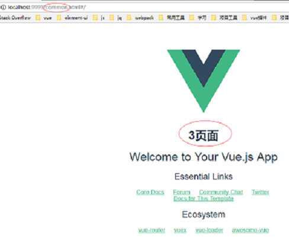

# vue-cli如何搭建多页面
### 本地先安装vue脚手架
```
npm install vue-cli
```
### 选取webpack模版（这里我们使用的是webpack模版）
###### 需要注意的是项目的名称不能大写，不然会报错。
```
vue init webpack Name(取项目名)
```
###### 选项翻译
```
Project name (my-project) # 项目名称（我的项目）

Project description (A Vue.js project) # 项目描述一个Vue.js 项目

Author 作者（你的名字）

Install vue-router? (Y/n) # 是否安装Vue路由，也就是以后是spa（但页面应用需要的模块）

Use ESLint to lint your code? (Y/n) # 使用 ESLint 到你的代码？ （Y [ yes ] / N [ no ]）

Pick an ESLint preset (Use arrow keys) # 选择一个预置ESLint（使用箭头键）

Setup unit tests with Karma + Mocha? (Y/n) # 设置单元测Karma + Mocha？ （Y/ N）

Setup e2e tests with Nightwatch? (Y/n) # 设置端到端测试，Nightwatch？ （Y/ N）
```


### 进去该项目
```
cd Name
```
### 安装依赖
```
npm install
```

### 运行
```
npm run dev
```

### vue-cli搭建的脚手架设置多页面原理，此次搭建的是写死的配置，后期添加动态方法

* 效果图：




#### 多页面布置分dev环境跟prod环境
##### 首先是公共配置
打开webpack.base.conf.js，找到entry，添加多入口
```
//多页面入口,文件开始路径为项目初始路径
entry: {
    mse: './src/entry/mse.js',
    from: './src/entry/from.js',
    common: './src/entry/common.js',
},

```
###### 运行、编译的时候每一个入口都会对应一个Chunk

#### dev环境部署

###### 修改 webpack.dev.conf.js
* 打开 ~\build\webpack.dev.conf.js ，在plugins下找到new HtmlWebpackPlugin，在其后面添加对应的多页，并为每个页面添加Chunk配置

```
    new HtmlWebpackPlugin({
      filename: 'mse.html',//访问地址
      template: './html/mse.html',//来源路径
      inject: true,//是否开启注入
      chunks: ['mse']//入口文件，在base里的入口参数entry配置，需要引入的Chunk，不配置就会引入所有页面的资源
    }),
    new HtmlWebpackPlugin({
        filename: 'from.html',
        template: './html/from.html',
        inject: true,
        chunks: ['from']
      }),
      new HtmlWebpackPlugin({
        filename: 'common.html',
        template: './html/common.html',
        inject: true,
        chunks: ['common']
      }),
```
* chunks: ['app']中的app对应的是webpack.base.conf.js中entry设置的入口文件

#### prod环境部署

###### 打开~\config\index.js，找到build下的index: path.resolve(__dirname, '../dist/index.html')，在其后添加多页

```
    build: {
        mse: path.resolve(__dirname, '../dist/mse.html'),
        from: path.resolve(__dirname, '../dist/from.html'),
        common: path.resolve(__dirname, '../dist/common.html'),
    ...
    }
```

###### 修改 webpack.prod.conf.js
* 打开~\build\webpack.prod.conf.js，在plugins下找到new HtmlWebpackPlugin，在其后面添加对应的多页，并为每个页面添加Chunk配置
* HtmlWebpackPlugin 中的 filename 引用的是 config/index.js 中对应的 build

```
    plugins: [
        new HtmlWebpackPlugin({
            filename: config.build.mse,//入口文件
            template: './html/mse.html',//来源路径
            inject: true,
            minify: {
                removeComments: true,
                collapseWhitespace: true,
                removeAttributeQuotes: true
            },
            chunksSortMode: 'dependency',
            chunks: ['manifest','vendor','mse']//需要引入的Chunk，不配置就会引入所有页面的资源
        }),
        new HtmlWebpackPlugin({
            filename: config.build.from,
            template: './html/from.html',
            inject: true,
            minify: {
                removeComments: true,
                collapseWhitespace: true,
                removeAttributeQuotes: true
            },
            chunksSortMode: 'dependency',
            chunks: ['manifest','vendor','from']
        }),
        new HtmlWebpackPlugin({
            filename: config.build.common,
            template: './html/common.html',
            inject: true,
            minify: {
                removeComments: true,
                collapseWhitespace: true,
                removeAttributeQuotes: true
            },
            chunksSortMode: 'dependency',
            chunks: ['manifest','vendor','common']
        }),
    ]
```

* 这是基于脚手架之多页面搭建的原理，后面会更新添加动态方法